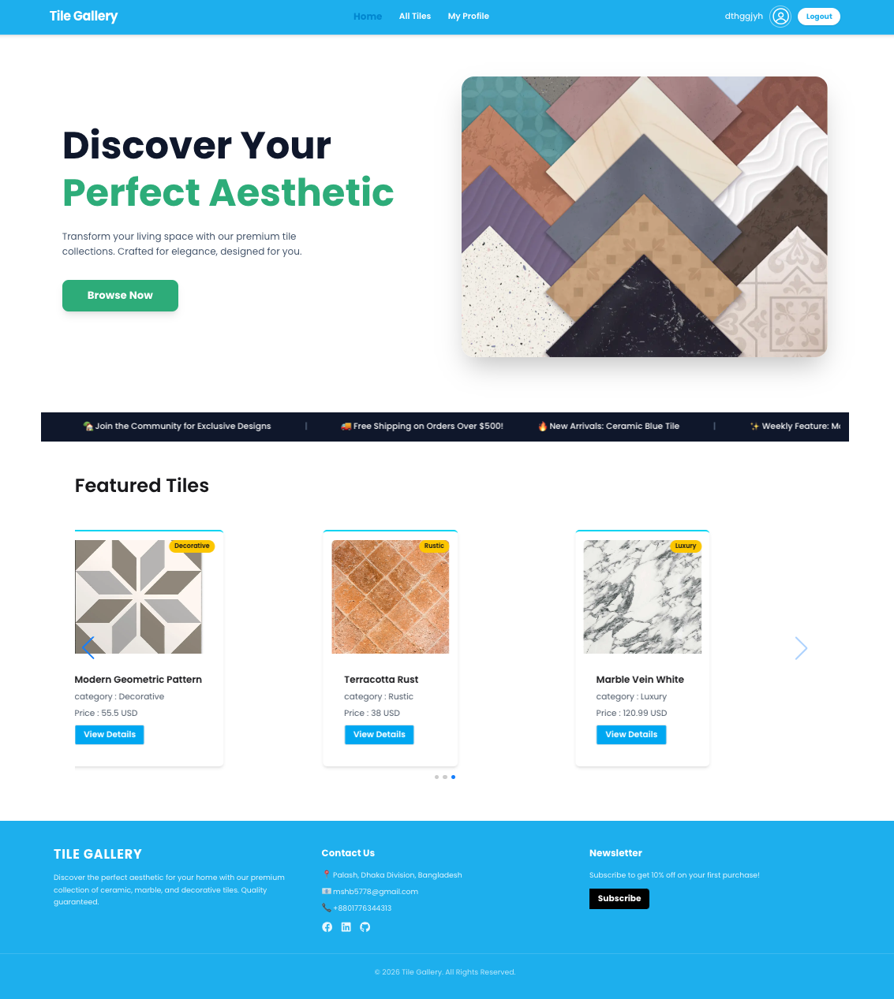

# 🧱 Tiles Gallery - Premium Ceramic & Wall Tiles Showcase

**Tiles Gallery** is a modern e-commerce inspired platform for exploring and discovering premium tile collections. It provides a seamless experience for users to browse, filter, and view detailed information about various tile products with a focus on high-quality visuals and performance.

🔗 **[Live Demo Link](https://a8-tiles-gallery-chi.vercel.app/)** | 📂 **[Source Code](https://github.com/sabbirhossain778/A8-Tiles-Gallery)**

---

## 📸 Preview


---

## 📝 Project Overview
বাসাবাড়ি বা অফিসের জন্য সঠিক টাইলস নির্বাচন করা এখন আরও সহজ। **Tiles Gallery** একটি ডিজিটাল শোরুম হিসেবে কাজ করে যেখানে ইউজাররা বিভিন্ন ডিজাইনের টাইলস দেখতে পারেন, সেগুলোর স্পেসিফিকেশন (সাইজ, মেটেরিয়াল) চেক করতে পারেন এবং নিজস্ব প্রোফাইল ম্যানেজ করতে পারেন।

---

## ✨ Key Features
- **Dynamic Hero & Product Sliders:** Swiper.js ব্যবহার করে আধুনিক এবং রেসপন্সিভ স্লাইডার যা সব ডিভাইসে স্মুথ কাজ করে।
- **Detailed Product Specifications:** প্রতিটি টাইলসের সাইজ, ক্যাটাগরি, দাম এবং ইন-স্টক স্ট্যাটাস দেখার জন্য ডেডিকেটেড পেজ।
- **Secure Authentication:** Better Auth (Auth.js) এর মাধ্যমে ইমেইল এবং গুগল সোশ্যাল লগইন সিস্টেম।
- **Responsive Navigation & UI:** মোবাইল-ফ্রেন্ডলি ড্রপডাউন মেনু এবং নেভবার যা সব স্ক্রিন সাইজের জন্য অপ্টিমাইজড।
- **User Profile Management:** পার্সোনালাইজড প্রোফাইল পেজ যেখানে ইউজার তাদের তথ্য দেখতে এবং আপডেট করতে পারেন।
- **Toast Notifications:** সফলভাবে লগইন বা কোনো অ্যাকশন সম্পন্ন হলে রিয়েল-টাইম ফিডব্যাক।

---

## 🚀 Technologies Used
- **Framework:** Next.js (App Router)
- **Styling:** Tailwind CSS & HeroUI (NextUI)
- **Animation:** Animate.css
- **Authentication:** Better Auth / Auth.js
- **Slider:** Swiper.js
- **Icons:** React Icons & Gravity UI Icons

---

## 📦 Major Dependencies
প্রজেক্টটি চালানোর জন্য নিচের মূল প্যাকেজগুলো ব্যবহৃত হয়েছে:
- `next`: ^14.x
- `react`: ^18.x
- `swiper`: আধুনিক টাচ স্লাইডার তৈরির জন্য
- `better-auth`: সহজ এবং সিকিউর অথেন্টিকেশনের জন্য
- `react-toastify`: সুন্দর অ্যালার্ট এবং নোটিফিকেশনের জন্য
- `@heroui/react`: প্রফেশনাল ইউআই কম্পোনেন্টের জন্য

---

## 💻 Local Setup Guide

Follow these steps to run the project locally on your machine:

1. **Clone the repository:**
   ```bash
   git clone [https://github.com/sabbirhossain778/A8-Tiles-Gallery](https://github.com/sabbirhossain778/A8-Tiles-Gallery)
